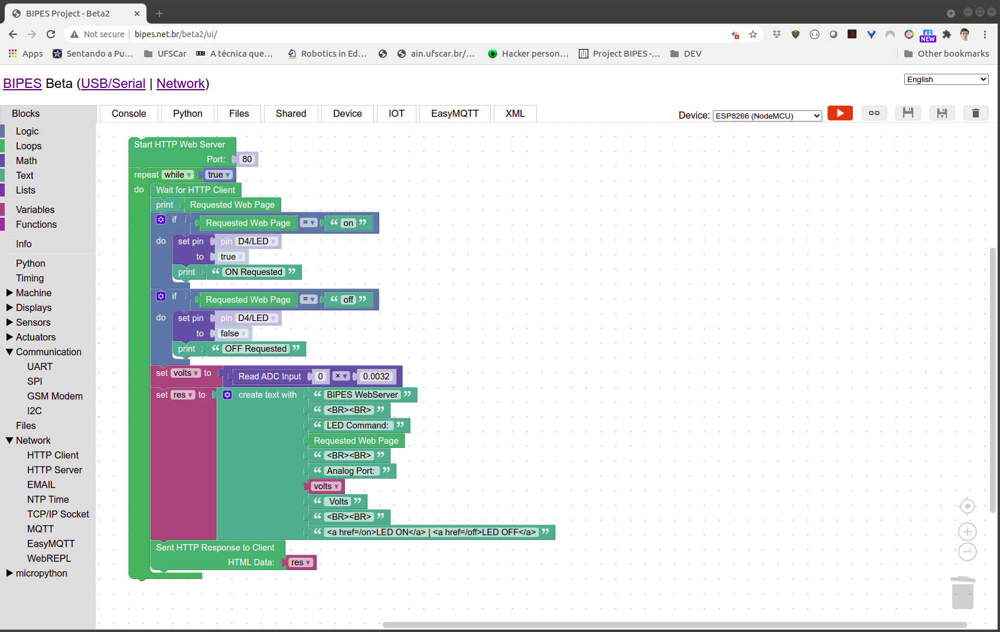

# BIPES: Block based Integrated Platform for Embedded Systems.




BIPES allows anyone to quickly and reliably design, program, build, deploy and test embedded systems and IOT devices and applications. It is fully based on a web environment, so absolutely no software install is needed on the client / developer machine. 

More information at the project website: https://bipes.net.br/ .

## Demo
Try it now at: http://www.bipes.net.br/beta2/ui/ .

## Usage

To build/update the offline version with latest, run:
```
make offline
```
This version does to require a server since it has all core files concatanated at `ui/index_offline.html`, just open this file in a browser. It will also create a `bipes_offline.zip`.


BIPES integrates WebREPL and Blockly. considere cloning these submodules into the same folder to update these core files:
```
make git-clone
```
Copy files from cloned repositories by
```
make copy
```
That's it.

## More informaton
Some functions of `ui/index.html` were based on Blopy project (https://github.com/mnoriaki/Blopy), by Noriaki Mitsunaga
 (https://github.com/mnoriaki).
 
 OpenCV blocks were automatically generated using berak's OpenCV to Blockly generator (https://github.com/berak/blockly-cv2/tree/master/gen).
 
We also use `xterm.js` (https://github.com/xtermjs/xterm.js/) and `codemirror.js` (https://github.com/codemirror/codemirror)
