# BIPES: Block based Integrated Platform for Embedded Systems



## Build from source

To build BIPES in your system, run

```
make
```

in the repository's root directory and follow the prompts.

It will install the dependencies, fetch and "compile" 
some JavaScript libraries and run a development server on port 5001.

Just enter http://127.0.0.1:5001/ide in the browser!

For subsequent runs in development mode, do 

```
make run
```

In development mode, different languages are acessed by including the language 
code to the link, e.g. http://127.0.0.1:5001/ide-de loads the IDE in german.

When configuring mosquitto MQTT broker, it will require root access to configure
it in the system.
Alternatively, you can setup inside docker.

### Using Docker

To build BIPES inside a docker container, run

```
make docker-build
```

after installing *docker* and *docker-compose-plugin*, and adding your user to the
*docker* group (to run Docker without root).

For subsequent runs in development mode, do 

```
make docker-run
``` 

The Docker version uses Docker Composes to connect a image running BIPES and
other running Mosquitto, this is an elegant solution to manage two independent
servicecs that communicate with each other.

Note: most parameters are not available for Docker, but you can pass explicitly 
modify the Makefiles and app.py defaults to achieve the same.

### Windows notes

On Windows, please use [WSL2](https://docs.microsoft.com/en-us/windows/wsl/install#install-wsl-command).

Install the usual stuff like `make` and `git` in WSL, then proceed with `make` in the
repository root directory.

## Documentation

The documentation provides tutorials on how to implement new blocks, help
with translation and even how to deploy your own version of BIPES.

Access it live at [bipes.net.br/3/docs](https://bipes.net.br/3/docs) or
build it from the clone with:

```
make docs
```

Then open *docs/_build/html/index.html*.

Note: requires [sphinx](https://www.sphinx-doc.org/en/master/), 
[sphinx-js](https://pypi.org/project/sphinx-js/) and 
[furo](https://github.com/pradyunsg/furo).

## Build release

The release is a static version of BIPES than can be run serverless.

BIPES serverless provides all functionalities that do not require a dynamic loading.

To generate this version do

```
make release
```

it will generate a tiny BIPES.zip file, which contain only the essential files 
plus many *ide-\*.html* files, each linking to language, e.g. *ide-es.html* 
loads the spanish version.

With this, extract anywhere and open the desired *ide-\*.html* file to use BIPES 
serverless.

For more options, see the documentation.

